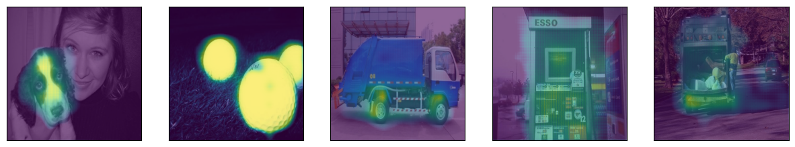

# Self-Supervised Attribution Method for Neural Networks

Model-agnostic post-hoc explainability method to produce attribution maps through a dedicated neural network trained in a self-supervised way without introducing new method specific hyperparameters, other than those of a classical neural network.




## Training

Training is done in two steps: (1) train the base classifier and (2) train the explanation module.

Model configurations are located in the `configs` directory. In the following commands, replace `[config]` with the desired configuration (e.g., `hateful-memes/base`)

To train the base classifier:
```bash
bash scripts/train1.sh [config] [gpus]
```

To train the explanation module:
```bash
bash scripts/train2.sh [config] [gpus] [classifier-checkpoint]
```


## Evaluation

Evaluation can be done by following the notebooks `eval-text.ipynb`, `eval-image.ipynb`, and `eval-multimodal.ipynb`.